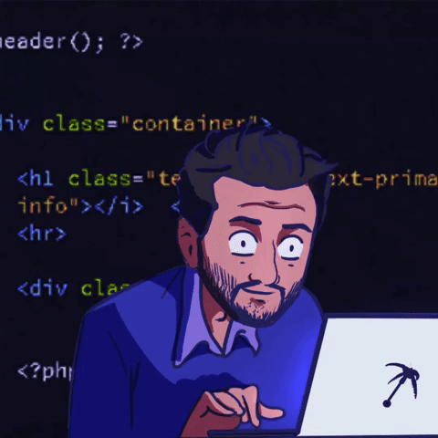

# Programmer Omer

 
<!-- 

Hello World, I am Omer.

I am a Full Stack Developer.

Programming is my hobby, passion, profession, ability, and everything to me.

  -->

  Hello World, I am Omer.
  

I am a Full Stack Developer.

  Programming is my hobby, passion, profession, ability, and everything to me.

 
 
 

## - Languages and Tools...

### Frameworks 

  <!-- For more icons please follow  https://github.com/MikeCodesDotNET/ColoredBadges -->
   
    
      
      

  ### Languages 
  

     
      
     
     

  ### Services 
  

    
   
    

   

  ### Tools 
  

   
   
 

  ## Social & Professional 
  

   <a href="<a href=mailto:omertopak1@gmail.com?subject=SweetWords&body=Please send me a copy of your new program!">Email Me</a>">
    
  </a>  
    